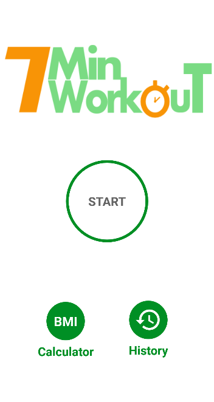
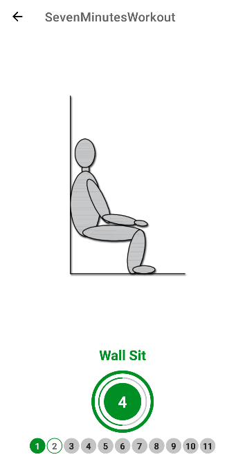
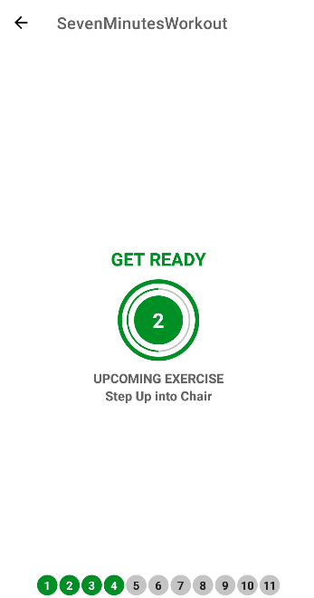

# 7 Minutes Workout

Project made during [The Complete Android 12 & Kotlin Development Masterclass](https://www.udemy.com/course/android-kotlin-developer/) by [Denis Panjuta](https://www.udemy.com/user/denispanjuta/).

It uses countdown timers, Media Player, Text To Speech and Room Database.

    
    
    
    

